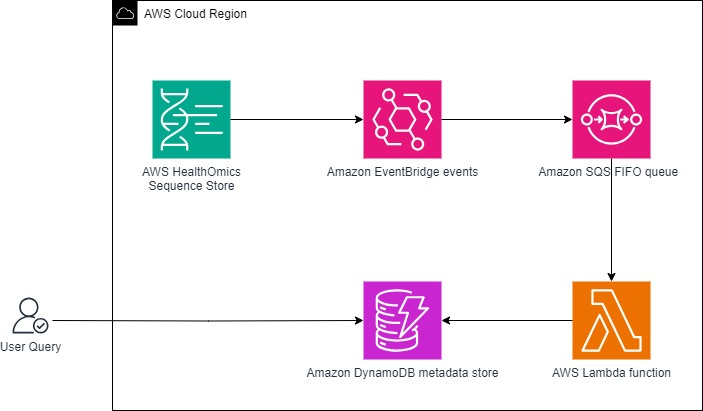

# Metadata sync for AWS HealthOmics Sequence Store

This is a simple CDK app demonstrating a Amazon Lambda driven, Amazon DynamoDB stored metadata sync for AWS HealthOmics.

## Prerequisites

* [AWS CDK](https://docs.aws.amazon.com/cdk/v2/guide/getting_started.html#getting_started_install) and all associated dependencies (like NodeJS)

## What's deployed
1. Amazon Lambda Function - An Amazon Lambda function is created that that takes a read set event and processes it into a Amazon DynamoDB update or insert
2. Amazon EventBridge Rule - A new rule is added to Amazon EventBridge that triggers the Amazon Lambda function that's created for read set status updates
3. (Optional) Amazon DynamoDB table - If a table name is not specified, a new Amazon DynamoDB table is created with the name `healthomics_set_metadata`
4. (Optional) Amazon SQS FIFO Queue name - If a queue name is not specified, new Amazon SQS FIFO queue is created with the name `healthomics_set_queue`

## Configuration

Edit the `cdk.json` file at the root of this project (where this README file is). Under the `context` property add the following attributes:

| attribute | type | required | description |
| :-- | :-- | :-- | :-- |
| `dynamoTableName` | string | yes | The table name of the Amazon DynamoDB table to write to.  This table should have a primary key of `set_arn` that corresponds to the arn of the read set. If this is not provided, the table will be created with the name `healthomics_set_metadata` |
| `SQSQueueName` | string | yes | The name of the Amazon SQS FIFO queue to store event messages. If this is not provided, the queue will be created with the name `healthomics_set_queue` |


An example configuration looks like:
```json
{
  ...
  "context": {
    "ddbTableName": "healthomics_store_metadata",
    "sqsQueueName": "healthomics_store_queue",
    ...
  }
}

```

## Setup and deployment

Assuming all prerequisites are satisfied, run the following at the root of this project (where this README file is) to install all NodeJS packages this app depends on:

```bash
npm install
```

Once the above is complete, you can use the AWS CDK to deploy the app using:

```bash
cdk deploy
```

> **NOTE**: you may need elevated (e.g. PowerUser or Administrator) privileges to your AWS environment to do this.

When the deployment successfully completes you should see something like:

```
HealthomicsStoreMetadataSyncStack: deploying... [1/1]
HealthomicsStoreMetadataSyncStack: creating CloudFormation changeset...

 ✅  HealthomicsStoreMetadataSyncStack

✨  Deployment time: 101.9s

Stack ARN:
arn:aws:cloudformation:us-west-2:111122223333:stack/HealthomicsStoreMetadataSyncStack/64e13c70-311d-11ef-ae34-02210fce62bf

✨  Total time: 104.69s


```

## Usage

The store creates an entry per read set with the following info: 

```{
  "set_id": "string",
  "set_reference_arn": "string",
  "set_subject_id": "string",
  "set_name": "string",
  "set_status": "string",
  "set_arn": "string",
  "set_sample_id": "string",
  "set_type": "string",
  "set_description": "string",
  "files": [
    {
      "file_path": "string",
      "etag": "string",
      "file_type": "string",
      "content_length": "string",
      "part_size": "string",
      "total_parts": "string"
    },
    ...
  ],
  "store": {
    "store_id": "string",
    "store_ap_arn": "string",
    "store_uri": "string",
    "store_arn": "string",
    "store_name": "string",
    "store_type": "string"
  },
  "tags": [
    {
      "<tag_key>": "<tag_value>"
    },
    ...
  ],
}
```

Since these are dynamo records, searching by the properties available can be done using Amazon DynamoDB's APIs. 

## Backfill

A backfill script is also attached in the repo to fill in records for an existing store.  For large stores this can take a long time and we encourage you to work with the AWS HealthOmics team to get the proper TPS limits set on the `GetReadSetMetadata` API.  The backfill will not populate the file information for Archived read sets as it is unavailable. When the read set is activated again, it will be populated. The backfill script will sync all read sets in the store and will overwrite any already in the store. The backfill script is available at `backfill_util/backfill_script.py`

The backfill has the following parameters 

| Parameter           | type   | required | description                                                  |
| :------------------ | :----- | :------- | :----------------------------------------------------------- |
| `-s --seq-store-id` | string | yes      | The ID of the sequence store to sync.                        |
| `-t --table`        | string | yes      | The table name of the Amazon DynamoDB table to put the data to.     |
| `-r --region`       | string | yes      | The region of the store and table. This must be the same.    |
| `--profile`         | String | no.      | (optional) The profile name for boto3 to use if you do not want it to use the default profile configured. |

From the command line, this function can be called as

`python backfill_script.py -s 1234567890 -t healthomics_set_metadata -r us-west-2`


As this processes, the system will print out every batch of processed read sets. 

## How it works



1. AWS HealthOmics automatically creates Read Set Status Update events in Amazon EventBridge.  
2. The Amazon Eventbridge events are stored in an Amazon SQS FIFO queue 
3. The Amazon SQS queue triggers the AWS Lambda function. 
4. The Amazon Lambda function determines if the Amazon DynamoDB table entry needs to be written, updated or deleted.  The read set status that triggered the event determines which of the following happens:
   1. ACTIVE: The read set metadata, read set tag information, and sequence store metadata is queried and the read set entry is refreshed. 
   2. ACTIVATING, ARCHIVED, DELETING: The status for the read set entry is updated based on read set ARN
   3. DELETED: The read set entry is deleted
   4. All other status changes are ignored


## Cost

The cost has not been calculated yet

## Cleanup


To remove the deployed resources run the following at the root of this project (where this README file is):

```bash
cdk destroy
```

No data in Amazon S3 or in Amazon DynamoDB is deleted during this operation. In addition, if a table was created in Amazon DynamoDB, it remains. 

## Security

See [CONTRIBUTING](CONTRIBUTING.md#security-issue-notifications) for more information.

## License

This library is licensed under the MIT-0 License. See the LICENSE file.
